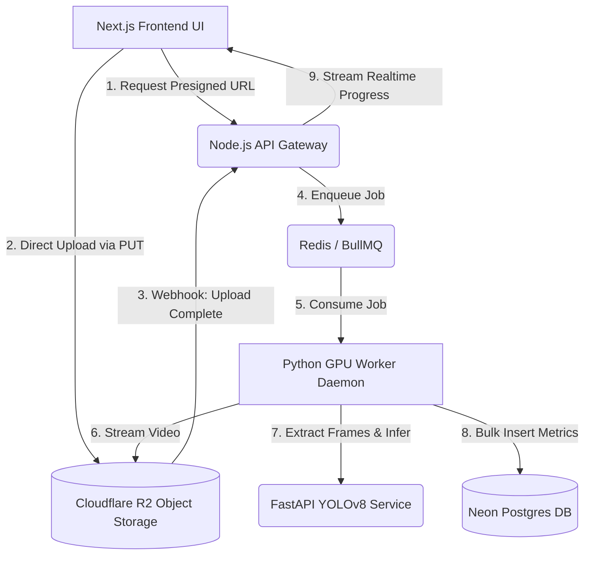

<p align="center">
  <br />
  <h1 align="center">AeroGuard</h1>
  <p align="center"><strong>AI-Powered Aircraft Inspection & 3D Digital Twin Platform</strong></p>
  <p align="center">
    
    
    
    
    
    
  </p>
</p>

<br />

## Table of Contents
1. [Project Overview](#1-project-overview)
2. [Technical Architecture](#2-technical-architecture)
3. [Complete Folder Structure](#3-complete-folder-structure)
4. [Source Code Documentation](#4-source-code-documentation)
5. [Technology Stack Analysis](#5-technology-stack-analysis)
6. [Feature Documentation](#6-feature-documentation)
7. [Installation Guide](#7-installation-guide)
8. [Configuration Documentation](#8-configuration-documentation)
9. [API Documentation](#9-api-documentation)
10. [Database Documentation](#10-database-documentation)
11. [Security Architecture](#11-security-architecture)
12. [Performance Architecture](#12-performance-architecture)
13. [Deployment Documentation](#13-deployment-documentation)
14. [Development Workflow](#14-development-workflow)
15. [Scalability Analysis](#15-scalability-analysis)
16. [Future Roadmap](#16-future-roadmap)

---

## 1. Project Overview

**AeroGuard** is an enterprise-grade, intelligent aircraft inspection platform. It replaces manual, error-prone borescope video reviews with automated defect detection, interactive 3D digital twin visualization, and compliance-ready reporting.

- **Business Problem:** Manual inspection of aircraft engines and airframes via borescope videos is incredibly time-consuming, highly subjective, and prone to human error, risking catastrophic failures and causing expensive grounded aircraft (AOG) time.
- **Target Users:** Maintenance, Repair, and Overhaul (MRO) organizations, commercial airlines, aircraft leasing companies, and aviation safety inspectors.
- **Core Value Proposition:** Reduces inspection time by up to 80% while increasing defect detection accuracy to 97%+. Transforms hours of video into actionable, 3D-mapped insights in minutes.
- **Key Differentiators:** 
  - True edge-to-cloud asynchronous AI pipeline.
  - Interactive 3D Digital Twin mapping of identified defects (using React Three Fiber).
  - Pre-trained on a proprietary dataset capable of identifying 5 core defect classes (Crack, Corrosion, Dent, Scratch, Welding Defect).
- **System Objectives:** To provide a robust, scalable, and secure platform that meets FAA/EASA compliance standards (SOC 2 Type II, ISO 27001 readiness) while offering a buttery-smooth UX.

---

## 2. Technical Architecture

AeroGuard employs a decoupled, asynchronous microservices architecture to offload GPU-intensive computer vision tasks from the client-facing UI and API gateways.

### High-Level Architecture Diagram



### Flow Breakdown
- **Data Flow:** Huge 4K borescope videos bypass the API entirely, uploading directly to Cloudflare R2 using AWS S3 Presigned URLs. 
- **Request Lifecycle:** R2 triggers a webhook to the Node API. The API validates the signature, stores the job in Neon Postgres, and drops a message in a BullMQ Redis queue.
- **Inference Lifecycle:** A Python worker process picks up the job, streams the video directly from R2 using OpenCV, runs it through the YOLOv8 service frame-by-frame, and dumps the resulting detections into Postgres.
- **State Management & Streaming:** The Next.js frontend utilizes `Zustand` for local state and establishes a Server-Sent Events (SSE) connection with the Node API to receive real-time updates on inference progress.

---

## 3. Complete Folder Structure

```text
aeroguard/
├── frontend/               # Client-side Next.js React Application
│   ├── public/             # Static assets, mock videos
│   ├── src/
│   │   ├── app/            # Next.js App Router pages (Landing, Login, Dashboard)
│   │   ├── components/     # Reusable React components (UI, 3D, Layout)
│   │   ├── config/         # App constants, navigation definitions
│   │   ├── lib/            # Utilities, API clients, mock data
│   │   ├── stores/         # Zustand state management stores
│   │   └── types/          # TypeScript interface definitions
├── node-api/               # API Gateway & Webhook Handler (Express)
│   ├── src/
│   │   ├── db/             # Drizzle ORM schemas, Neon DB client, migrations
│   │   ├── lib/            # R2 client, Redis client, BullMQ config, Webhook verifier
│   │   └── routes/         # Express routers (uploads, webhooks, jobs)
├── inference-service/      # Python FastAPI YOLOv8 Microservice
│   ├── app/                # Application code
│   │   ├── api/            # FastAPI router endpoints
│   │   ├── core/           # Configuration, logging
│   │   ├── schemas/        # Pydantic data models
│   │   ├── services/       # YOLO Model Manager, Detection Service
│   │   ├── main.py         # FastAPI App entrypoint
│   │   └── worker.py       # BullMQ Python Consumer Daemon
│   ├── cv_engine/          # YOLO Training & Evaluation Scripts
│   │   ├── data.yaml       # Dataset config
│   │   ├── train.py        # Model training script
│   │   ├── predict.py      # Standalone inference script
│   │   └── evaluate.py     # Evaluation metrics script
│   └── tests/              # Pytest test suites
├── nginx/                  # Nginx Reverse Proxy Configuration (Handles SSE buffering)
└── docs/                   # Internal architecture documentation
```

---

## 4. Source Code Documentation

### Frontend (`frontend/src`)
- **Components:** Modular atomic design. `shared/` for UI elements (Buttons, Badges), `dashboard/` for KPI cards and charts, `twin/` for the React Three Fiber 3D engine viewer (`EngineViewer.tsx`).
- **Pages:** Handled by Next.js 14 App Router. `app/page.tsx` is the dynamic marketing landing page. `app/app/dashboard` is the protected core application.
- **Hooks & Stores:** Heavy reliance on Zustand for global state. 
  - `inspection.store.ts`: Manages the complex multi-step upload and SSE pipeline state.
  - `twin.store.ts`: Manages 3D viewer state (wireframe vs solid, selected defects).
  - `assistant.store.ts`: Manages the generative AI chat interface state.
- **Utilities (`lib/`):** Tailwind `cn` merger, date/currency formatters, and the API wrapper (`api.ts`) for fetching presigned URLs and DB metrics.

### Backend (`node-api/src`)
- **API Routes:**
  - `uploads.ts`: Validates file sizes/types, inserts a pending job, and generates S3 presigned PUT URLs.
  - `webhooks.ts`: Listens for R2 `upload-complete` events, verifies HMAC-SHA256 signatures, and queues BullMQ tasks.
  - `jobs.ts`: Provides SSE streams (`/:jobId/stream`) for real-time progress and metric pagination endpoints.
- **Database (`db/`):** Uses Drizzle ORM against a Neon serverless Postgres DB. `schema.ts` defines `jobs` and `metrics` tables.

### Computer Vision & AI (`inference-service/`)
- **Model Manager:** A Singleton pattern (`app/services/model_manager.py`) ensures the heavy PyTorch/YOLOv8 model is loaded exactly once into RAM/VRAM during startup.
- **Detection Service:** Processes raw bytes, normalizes EXIF orientation, and extracts bounding boxes and confidences.
- **Worker Daemon (`worker.py`):** A BullMQ consumer that pulls jobs, streams video via OpenCV from presigned R2 URLs, samples frames based on FPS targets, runs inference, bulk-inserts metrics via `psycopg2`, and deletes the raw video from R2 to save storage costs.
- **CV Engine:** Contains scripts for continuous model retraining and evaluation.

---

## 5. Technology Stack Analysis

### Frontend
| Technology | Role | Benefits |
| :--- | :--- | :--- |
| **Next.js 14** | Application Framework | App Router, SSR capabilities, excellent performance. |
| **React Three Fiber** | 3D Rendering | Declarative 3D scenes integrated perfectly with React state. |
| **Zustand** | State Management | Boilerplate-free, fast, hook-based global state. |
| **Tailwind CSS** | Styling | Rapid UI development, utility-first, highly maintainable. |
| **Framer Motion** | Animations | Complex pipeline animations and page transitions. |

### Backend & Infrastructure
| Technology | Role | Benefits |
| :--- | :--- | :--- |
| **Node.js + Express** | API Gateway | High concurrency, excellent ecosystem for webhooks/SSE. |
| **Python + FastAPI** | Inference Service | Native integration with ML ecosystems (PyTorch, Ultralytics). |
| **Ultralytics YOLOv8** | Core AI Engine | State-of-the-art real-time object detection speed and accuracy. |
| **Neon (Postgres)** | Primary Database | Serverless scaling, branching capabilities, reliable relational data. |
| **Drizzle ORM** | Data Access Layer | Type-safe SQL, zero-dependency lightweight ORM. |
| **Redis + BullMQ** | Job Queue | Rock-solid delayed jobs, retries, and distributed processing. |
| **Cloudflare R2** | Object Storage | Zero egress fees, high performance, S3-compatible API. |
| **Nginx** | Reverse Proxy | Connection handling, specifically configured to disable buffering for SSE. |

---

## 6. Feature Documentation

<details>
<summary><b>1. Intelligent Video Processing Pipeline</b></summary>
Users upload 4K borescope videos. The system handles secure, direct-to-cloud uploads. A backend worker extracts frames dynamically based on motion/FPS targets and runs inference without blocking the UI.
</details>

<details>
<summary><b>2. 3D Digital Twin Interactive Dashboard</b></summary>
Displays an interactive, procedural 3D model of a jet engine. Detected defects are mapped accurately as glowing hotspots on the 3D model, colored by severity. Clicking a hotspot reveals specific dimensions and AI confidences.
</details>

<details>
<summary><b>3. Real-Time Telemetry & Progress Tracking</b></summary>
The UI features a dynamic pipeline tracker that uses Server-Sent Events to show the exact frame currently being analyzed by the GPU worker in real time.
</details>

<details>
<summary><b>4. AI Fleet Assistant</b></summary>
A chat interface (`AssistantStore`) that allows engineers to query fleet health, recurring defect patterns, and maintenance recommendations using natural language.
</details>

<details>
<summary><b>5. Role-Based Dashboards & Analytics</b></summary>
Provides a macro view of fleet health, recent inspections, risk matrices, and defect trending over time, tailored for MRO managers.
</details>

---

## 7. Installation Guide

### Prerequisites
- Node.js v20+
- Python 3.11+
- Docker & Docker Compose
- Cloudflare Account (for R2)
- NeonDB Account (for Postgres)
- Redis Server (or local via Docker)

### Environment Setup
Create a `.env` file in the root directory based on `.env.example`:
```bash
cp .env.example .env
```
Fill in the `R2_ACCOUNT_ID`, `R2_ACCESS_KEY_ID`, `R2_SECRET_ACCESS_KEY`, `R2_WEBHOOK_SECRET`, and `DATABASE_URL`.

### Cloudflare R2 CORS Configuration
To enable direct uploads, set the CORS policy on your R2 bucket:
```json
[
  {
    "AllowedOrigins": ["http://localhost:3000"],
    "AllowedMethods": ["PUT", "GET", "HEAD"],
    "AllowedHeaders": ["*"],
    "ExposeHeaders": []
  }
]
```

### Local Development (Using Docker Compose)
The easiest way to run the entire stack (Node API, FastAPI, Nginx, Redis, Next.js, and Worker):
```bash
docker compose up --build
```
* The Next.js Frontend will be available at `http://localhost:3000`.
* The API Gateway is routed through Nginx at `http://localhost:3001`.

### Database Migrations
To initialize the schema in NeonDB:
```bash
cd node-api
npm install
npm run db:migrate
```

---

## 8. Configuration Documentation

- **`.env` variables**: Centralized configuration handling Cloudflare keys, Database URIs, and Redis endpoints.
- **`next.config.js`**: Frontend configuration.
- **`docker-compose.yml`**: Defines the orchestration. Notably, Nginx is configured to bypass proxy buffering (`proxy_buffering off;`) to ensure the SSE streams are not delayed or batched.
- **`tailwind.config.ts`**: Contains the enterprise design system tokens (colors, fonts, animations).

---

## 9. API Documentation

### Node API Gateway (`http://localhost:3001`)

| Endpoint | Method | Purpose | Auth |
| :--- | :--- | :--- | :--- |
| `/api/v1/uploads/presign` | `POST` | Generates a signed S3 URL for video upload. | JWT (Planned) |
| `/api/v1/webhooks/upload-complete`| `POST` | R2 Webhook listener. Verifies HMAC signature. | HMAC-SHA256 |
| `/api/v1/jobs/:jobId/stream` | `GET` | SSE stream for real-time inference progress. | Session |
| `/api/v1/jobs/:jobId/metrics` | `GET` | Fetch paginated defect metrics for a completed job. | Session |

### Inference Service (`http://localhost:8000` - Internal Only)

| Endpoint | Method | Purpose | Note |
| :--- | :--- | :--- | :--- |
| `/health` | `GET` | Checks if YOLO is loaded into memory. | Internal |
| `/detect` | `POST` | Accepts a multipart image and returns bounding boxes. | Called by worker |

---

## 10. Database Documentation

Powered by Neon Postgres. Schema defined via Drizzle ORM.

### Key Tables
1. **`jobs`**: Tracks the lifecycle of a video upload.
   - `id` (UUID), `r2_object_key`, `file_size_bytes`, `status` (pending, uploaded, queued, processing, completed, failed, purged).
2. **`metrics`**: Stores individual defect detections per frame.
   - `id` (UUID), `job_id` (FK), `frame_timestamp_ms`, `label` (class name), `confidence`, `bbox_x1/y1/x2/y2`.

**Indexing Strategy:** B-Tree indexes exist on `jobs.status` (for fast queue recovery) and `metrics.job_id` (for lightning-fast metric retrieval during report generation).

---

## 11. Security Architecture

- **Direct-to-Cloud Uploads:** The Node API never touches the massive video payloads, preventing memory exhaustion (DDoS protection).
- **HMAC Webhook Verification:** R2 webhooks are cryptographically verified using `timingSafeEqual` to prevent timing attacks.
- **Network Isolation:** The Python `inference-service` and `worker` are hidden within the internal Docker network. Only the Nginx proxy (port 3001) and Frontend (port 3000) are exposed.
- **Idempotency:** Webhooks and job queues are strictly idempotent to prevent double-processing.

---

## 12. Performance Architecture

- **SSE (Server-Sent Events):** Used over WebSockets for lightweight, unidirectional real-time progress streaming without overhead.
- **Nginx Tuning:** `chunked_transfer_encoding off` and `proxy_buffering off` ensure SSE streams reach the client instantly.
- **Model Singleton:** The YOLOv8 model is loaded into RAM/VRAM exactly once during FastAPI `lifespan` startup, guaranteeing ultra-low latency inference.
- **Auto-Purging:** The worker automatically deletes the massive raw video files from Cloudflare R2 immediately upon successful inference extraction, saving storage costs.

---

## 13. Deployment Documentation

### Docker / Self-Hosted
Use the provided `docker-compose.yml`. Ensure the host machine has sufficient RAM (at least 8GB) and ideally an NVIDIA GPU configured with Nvidia-Container-Toolkit for the inference service.

### Vercel (Frontend)
1. Import the `frontend/` directory to Vercel.
2. Set `NEXT_PUBLIC_API_URL` to your deployed Node API URL.
3. Deploy.

### Render / Railway (Node API & Python Services)
1. Deploy `node-api` as a Web Service. Set all environment variables.
2. Deploy `inference-service` as a Private Service (not exposed to the internet).
3. Deploy a Redis instance.
4. Ensure internal routing is properly configured in `.env`.

---

## 14. Development Workflow

- **Formatting & Linting:** Standard `eslint` and `prettier` configurations are included in the frontend.
- **Python Tests:** Run the Pytest suite in `inference-service/tests/` to validate model loading and API integrity: `python -m pytest tests/ -v`.
- **Branch Strategy:** Standard GitFlow (Feature branches off `develop`, merged via PR to `main`).

---

## 15. Scalability Analysis

- **Current Limitations:** The Python worker is currently synchronous (`process_video_job_sync`). It blocks on OpenCV video reading.
- **Scaling Strategy:** 
  - **Horizontal:** Spin up multiple replicas of the `inference-service` container across a Kubernetes cluster. BullMQ will automatically distribute jobs across all available workers.
  - **Vertical:** Assign GPUs to the inference nodes and change `DEVICE=cuda` in the environment to process frames asynchronously via PyTorch CUDA streams.
- **Enterprise Readiness:** The system is inherently designed to handle massive scale. Because video uploads go directly to R2 and processing is handled by async background queues, the web gateway remains 100% responsive regardless of video size or inference backlog.

---

## 16. Future Roadmap

1. **Q3 2026:** Implement full JWT-based authentication and role-based access control (RBAC).
2. **Q4 2026:** Integrate LLM-powered automated PDF report generation directly from the NeonDB metrics.
3. **Q1 2027:** Upgrade the YOLOv8 model to handle multi-class segmentation for exact defect area calculations, rather than simple bounding boxes.
4. **Q2 2027:** Implement a web-based video scrubbing UI to allow inspectors to verify and manually adjust AI bounding boxes before finalizing reports.
